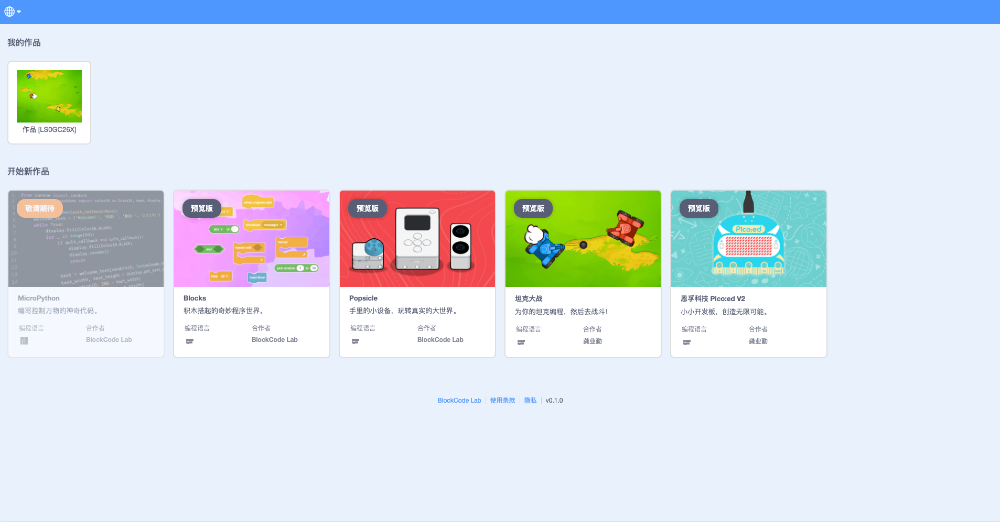
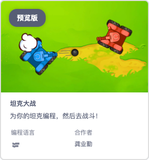
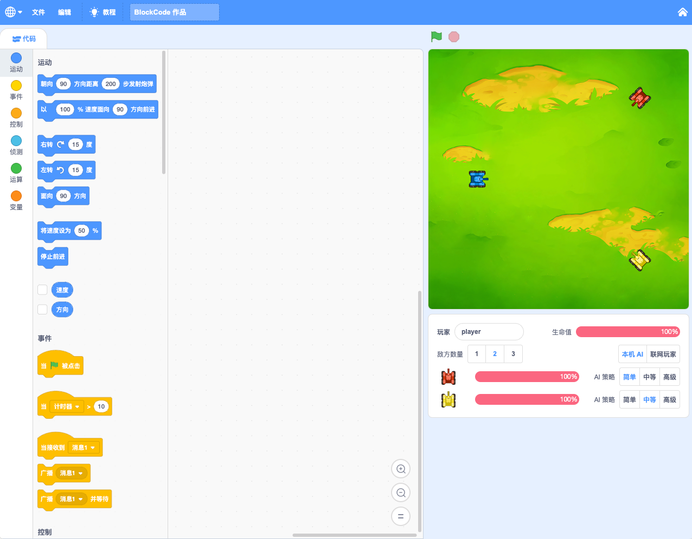

今天开博，啥也别说。只有一事，[BlockCode Playgrounds](https://make.blockcode.fun/ "BlockCode Playgrounds") 很快上线，现在测试。

《坦克大战》可以一试，图形编程操控坦克，自主战斗击败敌机。这是一款对坦克进行编程控制实现自主对抗的游戏，和原版的使用代码编程不同，这里采用图形化编程界面，让更多的小朋友可以在学习图形编程的过程中，多一个练习技术和训练思维的地方。以后将增加联网对战功能，大家就可以把自己编写好的程序分享出去，和其他玩家编写的程序对抗，不断磨练，更具挑战。现在还只有和电脑 AI 对战的功能，已经[上线测试](https://make.blockcode.fun/)，欢迎大家可以体验尝试。

而且《坦克大战》这个项目还准备开发配套硬件，作出可以编程的坦克，将虚拟的坦克大战搬到现实中，在擂台上多个坦克实体对抗，赢取胜利。如果顺利，应该不久就会发布。敬请期待。
