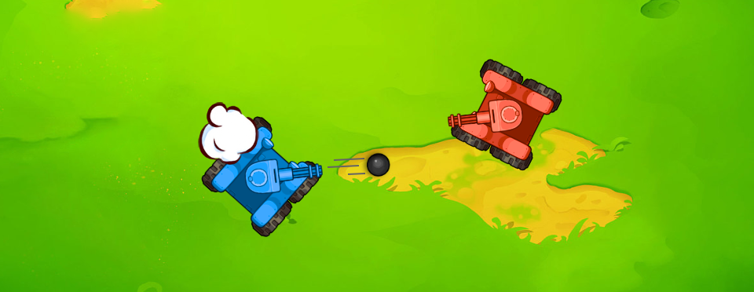
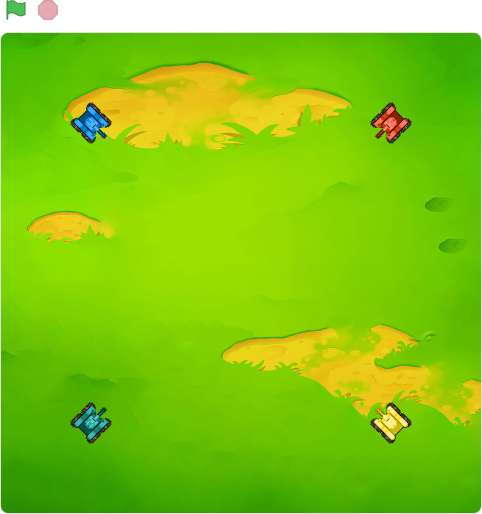
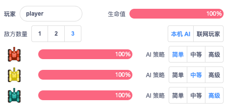
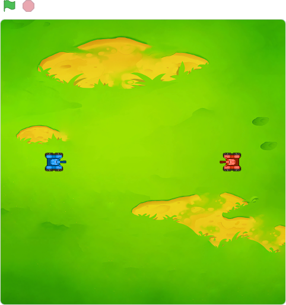
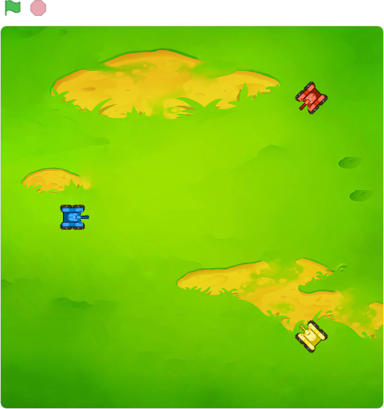
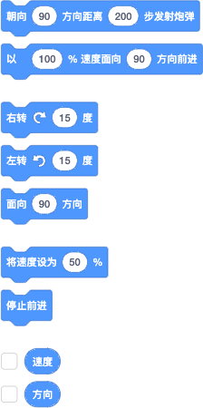
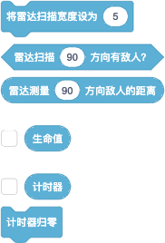
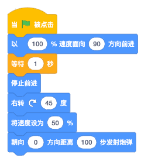
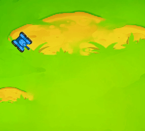
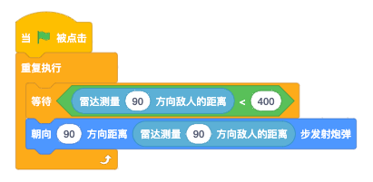

在十多年前，有一个叫 CodeTank 的线上编程游戏，采用 JavaScript 作为游戏编程语言，编写智能坦克机器人的程序，让坦克自主对抗。而在更早的二十年前也有一个 Robocode 的编程游戏，采用 Java 作为游戏编程语言，同样也是编写坦克机器人的程序，让坦克自主对抗。这些游戏都采用了相同的机制来设计，我们的[《坦克大战》](https://make.blockcode.fun/)也是一样的，不同的是各自采用的编程语言，我们采用了更简单的图形化，让学习图形化编程的小朋友也能加入这场智能坦克大战中。

坦克机器人由三个部分组成：车身（移动行走）、炮台（发射炮弹）和雷达（侦测敌人），三个部分独立编程控制，都可以独立 360° 转动。玩家需要侦测敌人、攻击敌人还要躲避敌人，在生命值消耗殆尽前，看谁最后留在战场为赢家。

## 战场和信息设置

战场和 Scratch 的舞台很相似，不同的是尺寸和编辑功能。战场的大小是-480 ～ 480，XY 都一样，切不具备编辑功能。战场不设边界，坦克可以开出战场（就看不见了），所有对战场的设置需要通过战场下方的信息和设置区来进行。

点击“小绿旗”开始新一轮大战，点击红色按钮停止战争并重置所有坦克。在大战开始后，玩家无法改变坦克行为，也不能修改程序，只能由已编写好的程序自主控制坦克与其他敌方坦克进行战斗，直到唯一赢家诞生或点击红色停止按钮。

现在版本可以查看各两坦克的生命值，和调整战场的敌方坦克的数量：1、2、3，以及改变坦克的 AI 策略级别：简单策略的敌人只会在中线来回移动，朝四个方向侦测目标进行攻击；中等策略的敌人会 360° 侦测目标，并移动到有效供给范围后进行攻击，在被攻击后会随机往一个方向逃离；高级策略的敌人会前往四个角落，然后 360° 侦测目标，如果侦测两圈后没有发现目标就随机前往另一个相邻的角落，如果被攻击也会随机前往另一个相邻角落。

联网游戏功能暂未开放，未来还会有战场的天气和地形的调整设置。

### 不同敌人数量的战场

挑战不同数量的敌人会让游戏难度和编程策略都有所不同，1 个敌人时直接面对面，不是你死就是我亡；2 个敌人时，可以迂回一下，让敌人先拼……

## 编程积木

保留了 Scratch 中的事件、控制、运算和变量类积木，移除了原本的运动、外观、声音和侦测类等用不到的编程积木（自制类的积木以后版本会添加回来）。为坦克添加了新的运动和侦测类积木，用来控制坦克的行为，下面主要来介绍一下新增加的编程积木。

### 运动积木

控制坦克的移动和火力，部分设定和真实坦克类似，坦克在战场中会有真实的碰撞，如果前进方向上碰到障碍（地方坦克）后会停止前进，前方障碍移开后可以恢复前进。发射炮弹的最近距离 70px，最远 400px；车身、炮台和雷达的转向速度均为 360°/秒，移动的最大速度是 105px/秒。运动方向的设定和 Scratch 的设定一致，90 方向是面向（车头或炮管）右，0 方向是面向上。

我们通过实例来说明积木的使用，例如，开始后，坦克往 90 方向（右）全速前进 1 秒后停下来，向右转 45° 后再 50%的速度前进，并同时向 0 方向（上）100px 距离开火，我们可以这样编写程序：

### 侦测积木

控制坦克雷达侦测敌方坦克，雷达侦测的最小宽度（角度）是 1°，最大是 40°，最远距离是 500。只要在雷达的范围发现有敌人，就会被侦测到。雷达的宽度会影响雷达侦测的时长，越小的宽度越快，默认的宽度是 4°。侦测到的距离配合运动积木的发射炮弹就可以实现朝敌人发动攻击了。

侦测自己的生命值，在生命值改变时作出相应的行动策略。

例如，我们让坦克一直扫描 90 方向的敌人，一旦敌人进入攻击距离就开火：

## 结尾

[《坦克大战》](https://make.blockcode.fun/)的基本介绍就这样了，以后再写一些基本策略的编程案例，让大家好理解编写 AI 策略的思路。那这么好玩的编程游戏，大家只要进入 [BlockCode Playgrounds](https://make.blockcode.fun/) 选择[《坦克大战》](https://make.blockcode.fun/)开始新作品就可以了。
