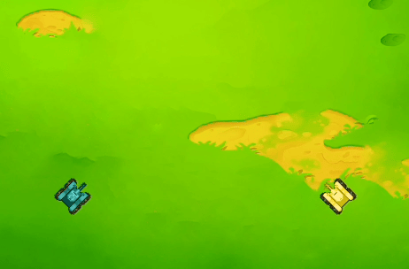

有朋友说，《坦克大战》看 AI 打得挺有意思，但是要自己编程就不知道该如何入手了。从今天开始，我们会出一个简单的系列课程，讲讲《坦克大战》的一些基础编程思路。

先来看一下教程的规划，这个教程分为两个阶段，目前主要是第一阶段（新兵）的教程内容规划，第二阶段（实战）将会对应以后要发布的实体坦克的相关内容。本教程对应有基本图形编程经验的朋友，能熟练使用和了解图形编程的基本运行逻辑，对于小白朋友可以先学习基本的图形编程相关知识，再来看本教程。

```markmap
# 坦克训练营

## 新兵营地

- 新兵操练

  - 坦克移动
  - 炮塔开火
  - 信息侦测

- 新兵策略

  - 保命策略
  - 追击策略
  - 躲避策略
  - 动线规划

## 沙盘实战

- 坦克整备

- 沙盘演练

```

!> 敬请关注我们的动态，实体坦克随时发布。:+1:
