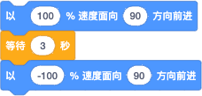

---

<!-- slide:break-40 -->

这个积木的作用就是让坦克朝某个方向以固定的速度前进或后退，直到使用“[停止](/2024/0205-2/slide/3.md)”积木才会停下来。

速度可以设定在 -100% ～ 100% 之间，如果是 0 这表示停止，如果速度值是负数表示后退。

坦克的方向 0 是朝北（上）、90 是朝动（右）、180 是朝南（下）、-90 是朝西（左）——和 Scratch 的方向设定一致。

