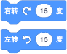

**方向分量**

当设定的方向与坦克之前的方向不同时，坦克就会转向，转向速度为 360°/秒。转向积木在角度设为负值时，效果与所描述的相反。

---

**速度分量**

移动的最大速度大约是 105px/秒，速度的改变会及时反应出来。

<!-- slide:break -->

当同时设定方向和速度时，我们可以使用之前认识的“[移动](/2024/0205-2/slide/1.md)”积木，当需要单独对移动动作的分量——方向或速度进行控制时，就可以方向分量和速度分量的积木了，而且用分量组合实现的效果也更丰富。

?> 下面的两组积木实现的效果是相同的。

!> 注意方向和设定速度的顺序，如果是先设定速度然后设置方向，就会和左边的“移动“积木效果稍微有点区别了，因为转向最长需要 1 秒，而设定速度时立即生效，出现的效果就会是先按原来的角度前进，然后再转向。
