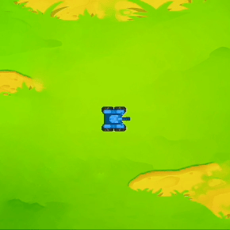

---

<!-- slide:break-40 -->

通过这两个积木可以获取到在指定方向上有无敌人以及敌人的距离是多少，雷达可以侦测到的最远距离是 500px（比炮弹可攻击的最远距离要远）。

雷达只有一个，同一时间只能扫描一个角度。所以我们需要不断修改雷达扫描的方向，才能对坦克四周进行 360° 的侦测，这需要配合变量来进行编程。

雷达测量的敌人距离可以直接用作发射炮弹的攻击距离（但是要注意最大攻击距离和测量的距离大小）。

