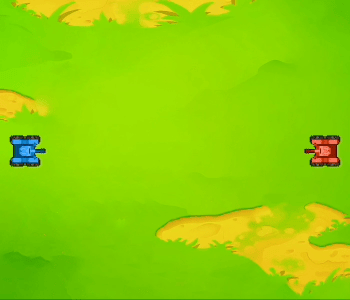

现在我们来思考一下，如何能作出右边案例中蓝色坦克的行动策略：:point_right:

（单击此处显示策略思路）

?> 这个策略的基本思路就是——挨打就跑：当我们的坦克被敌人的炮弹攻击到，那么立即朝一个方向逃跑。

**要实现这个策略需要分一下几个步骤：**

1. 检测到自己被攻击——收集信息
2. 选择一个方向逃跑——制定策略并执行
3. （确定安全）停下来

<!-- slide:break-60 -->

