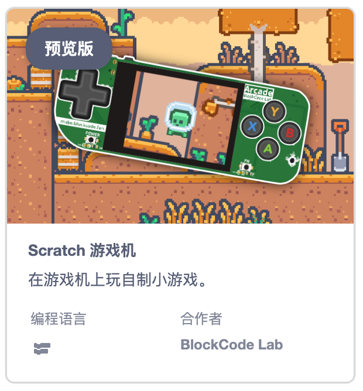
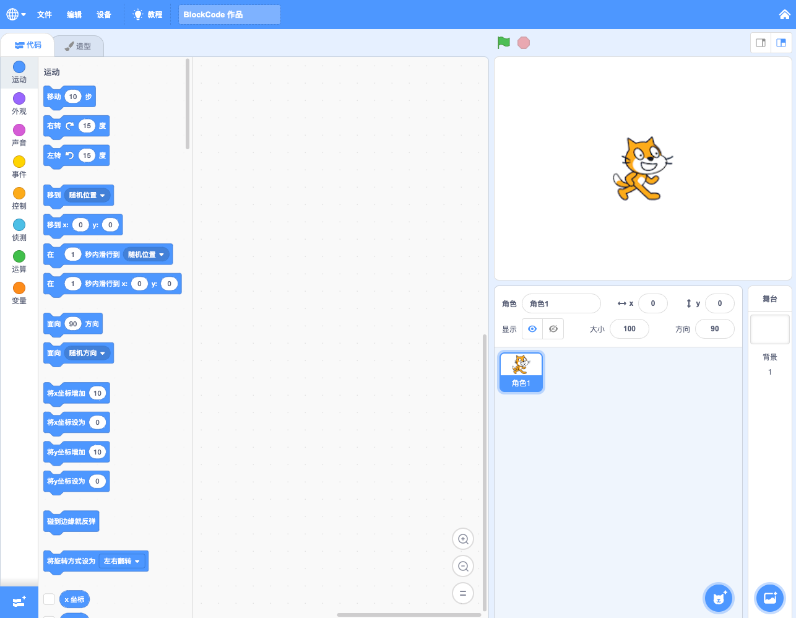

有段时间没有更新了，过了一个寒假，休息了一下，也调整了一下。开年有了一个新计划，把去年开始学习设计电路板时制作的游戏机 [PicoArcade](https://oshwhub.com/kankungyip/picoarcade) 进行升级，改为采用 ESP32-S3 重新设计，并使之可以用 [BlockCode Playground](https://make.blockcode.fun) 进行游戏编程，成为一个图形编程的开源游戏机。

说到图形编程游戏机就会想到 MakeCode Arcade，不过一直不怎么喜欢 MakeCode 的交互和编程思想，而更喜欢 Scratch（BlockCode Playground 也是基于 Scratch 的交互流程设计的），Scratch 的舞台天然就是一个游戏机的屏幕，所以只需要一个硬件能承载这个舞台就可以了，这也是设计新的 Scratch Arcade 游戏机的初心——之前在另一个硬件项目（Popsicle）中已经实现，不过现在重新定义了产品目标，所以衍生出 Scratch Arcade 这个项目，原来的项目将有其他使命。

## PicoArcade VS. Scratch Arcade

以前的 PicoArcade 是这个样子的:

新版的 Scratch Arcade 是这个样子的（效果图）：

!> 老版本的 PicoArcade 只能通过 MicroPython 编程制作小游戏，新版的 Scratch Arcade 将通过 [BlockCode Playground](https://make.blockcode.fun) 图形编程制作游戏，更适合少儿编程的教学。

## Scratch Arcade 图形编程

在 [BlockCode Playground](https://make.blockcode.fun) 中有 Scratch Arcade 图形编程工具，进入后和 Scratch 的界面几乎是一模一样的，不过有一点小差别，因为硬件的限制（具体差异在 Scratch Arcade 正式发布后再详细列举），有极少部分的 Scratch 原本的功能有所打折，无法和原版的一模一样，但是编程的逻辑和交互流程是一模一样的。

## 发布时间

Scratch Arcade 正式发布时间暂定 **2024-4-1** 敬请期待。
