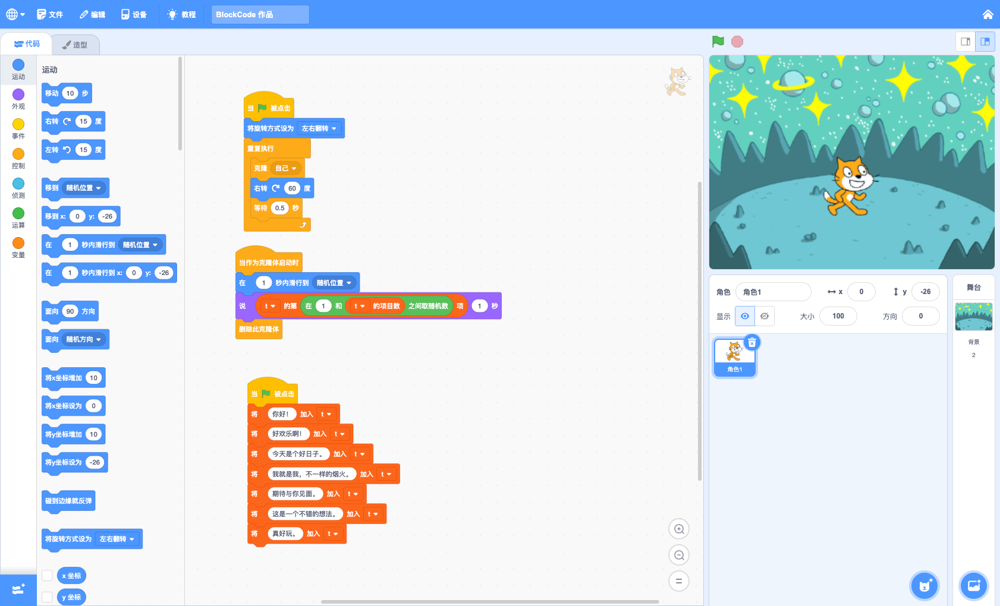

这是一款天然具有教育属性的少儿编程硬件产品，非常符合国内目前的小学阶段编程教育（Scratch图形化和Python编程），以往的编程学习在教学过程中逐渐变得模式单一，程序模版化，学生兴趣下滑。这款产品将完全弥补这些不足，提升教学内容的丰富性，程序的多样性和变化性，学生的成就感获得完全提升，并且完全不改变现在已有的教学内容，完全拿来即用。

!> 产品将于今年下半年正式发售。

## 产品特性

| 硬件   | 说明                                                                        |
| ------ | --------------------------------------------------------------------------- |
| 芯片   | **ESP32-S3** Xtensa&copy;双核 240 MHz   8MB SPI flash   8MB PSRAM |
| 屏幕   | 2.0寸 TFT 彩屏，**320×240**                                                 |
| 网络   | 802.11b/g/n Wi-Fi   Bluetooth 5                                        |
| 电池   | 800mAh 7.4v 锂电池                                                          |
| 按钮   | 可编程按钮 × 9                                                              |
| 麦克风 | MEMS 麦克风 × 1                                                             |
| 接口   | Type-C USB × 1   2.5mm 耳机 × 1   外设扩展口 × 1                  |
| 尺寸   | 100mm × 38mm                                                                |

### 屏幕

**2.0寸** 大屏幕的TFT彩色屏幕，支持多达 65536 种丰富的颜色（**16位色**），分辨率达到 **320×240** 像素，可以呈现游戏广阔的舞台，结合 TileMap（敬请期待） 实现庞大的 2D 游戏世界。

### 网络

由 ESP32-S3 带来的强大网络功能，支持 802.11b/g/n Wi-Fi 和 Bluetooth 5，结合网络 AI 服务，轻松实现语音识别（需要板载麦克风）、图像识别（需要扩展摄像头）、家庭自动化等等功能，掌握前沿科技知识，多台游戏机还可以实现多机互联，实现对战游戏。

### 交互

9个可编程的按钮——四个方向按钮（**上/下/左/右**）、四个标准游戏按钮（**A/B/X/Y**）和一个功能（**Fn**）按钮，通过编程赋予这9个按钮不同的功能呢，实现各种游戏玩法，丰富程序交互能力。

板载的MEMS麦克风可以实时录音，结合网络就可以进行语音控制、语音识别、AI 对话等功能

### 接口

- 板载 Type-C USB 接口进行充电和程序下载。
- **2.5mm耳机接口**，可以连接耳机听音乐或连接传感器模块探测环境数据。
- **外设扩展口**，实现连接更多的外设硬件模块（敬请期待），可以连接摄像头模块、舵机模块、超声波模块、颜色识别模块……丰富游戏程序的互动方式和功能。

!> 外设硬件模块不定期上新，敬请期待。

## 编写程序

在 [BlockCode Playgrounds](https://make.blockcode.fun/) 使用图形化（Scratch）或 MicroPython 进行编程。

### 图形化（Scratch）

界面与Scratch完全一样（暂缺“声音”模块，敬请期待），大部分的编程积木模块也都一样，少部分因为硬件特征有所不同（以后缺少的部分会逐步补全，更贴近原版 Scratch 的积木模块和功能），更方面熟悉Scratch的老师进行教学。

扩展模块差异比较大，拥有更多硬件（需要连接相应外设）方面的控制模块和AI模块。

|      | 差异                                                                                                                                                                 |
| ---- | -------------------------------------------------------------------------------------------------------------------------------------------------------------------- |
| 舞台 | 宽高比和原版Scratch保持一致，但分辨率有所减小——320×240，x坐标从-160到160，y坐标从-120到120。 不显示变量，变量内容的显示将在新增的“数据监控栏”（敬请期待）。      |
| 造型 | 造型资源只有位图模式，不支持矢量图模式，Scratch 中的造型都可以使用。                                                                                                 |
| 背景 | 除了Scratch中的位图背景，还支持 **TileMap背景**以及**AI背景**。  **TileMap背景**使用瓦片图制作超大的游戏地图；**AI背景**使用生成式AI通过文字来生成一副位图背景。 |

### MicroPython

固件基于 MicroPython 1.22 版本编译，增加了特有的包，更方便开发游戏和小程序。游戏开发部分移植了一个简化的 PyGame 包，更方便进行 Python 语言的教学和游戏项目开发。

!> MicroPython 编程平台敬请期待。

## 课程

图形化（Scratch）编程课程分为基础、高级、进阶三阶段课程，前两个阶段各32课时，进阶课程以项目制课时不等，项目数也会逐步扩充。

| 阶段     | 课时   | 说明                                                                                     |
| -------- | ------ | ---------------------------------------------------------------------------------------- |
| 基础 I   | 16课时 | 了解基本的编程知识，熟悉各种编程结构和编程思维方式，了解人工智能和简单的扩展外设。       |
| 基础 II  | 16课时 | 掌握简单的算法和复杂编程逻辑，学习以目标为核心的解决问题的思维方式。                     |
| 高级 III | 16课时 | 学习复杂游戏项目的开发，掌握项目式思考问题的方式。                                       |
| 高级 IV  | 16课时 | 学习物联网和网络服务的编程，运用网络解决生活中的问题，学习用编程思维解决实际问题的能力。 |
| 进阶 V   | x课时  | 项目制课程，每个项目课时不等，掌握综合解决问题的能力。                                   |

!> MicroPython编程课程后续发布，敬请期待。
