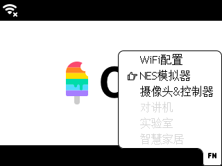
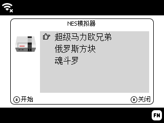
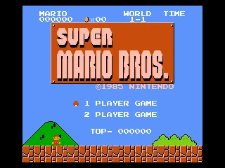

> 🫡致敬OS的设计，以及伟大的Steve Jobs

这是为[Arcade](https://arcade.blockcode.fun/)设计的一个操作系统，也将为了以后的系列产品服务。这个操作系统可以提供基本的作品程序管理以及系统功能的使用。

## 特色

- **系统集成**：集成了多个子系统功能，不需要切换固件即可使用；
- **操作简单**：充分利用已有按键，直观简洁的操作流程；
- **作品管理**：方便的作品管理，可以对作品进行删除和运行；

## 系统功能

子系统功能通过**Fn按键**调出菜单选择，后期还增加更多实用的系统功能。

### Wi-Fi配置

通过SmartConfig技术，快速的对[Arcade](https://arcade.blockcode.fun/)进行网络设置，让设备连接上网络。进入Wi-Fi配置后，只需要使用微信扫描二维码，就可以开始进行配网，网络只支持2.4G网络。配置完成后，会将网络信息记录下来，下次就不需要再进行设置，开机就能连上网络。

连网后系统系统会自动获取当前时间，并显示在右上角。

!> 也可以通过[BlockCode Playgrounds](https://make.blockcode.fun/)在电脑上设置设备的网络。

### 摄像头&控制器（测试中）

通过网络功能，将[Arcade](https://arcade.blockcode.fun/)作为无线控制器，可以接受图传画面显示和遥控设备。只需要轻松简单的步骤完成，将Camera模块对准屏幕扫描，将自动完成模块的配网。配网成功后，[Arcade](https://arcade.blockcode.fun/)上将显示摄像头所拍摄的画面。

摄像头有两种连接方式，一种是直接连接到Camera模块的热点网络；另一种是将Camera连接到[Arcade](https://arcade.blockcode.fun/)已经连接的Wi-Fi网络。前者更加稳定和高速，后者视Wi-Fi网络的质量有所不同。

!> 同时也支持[BlockCode Playgrounds](https://make.blockcode.fun/)在电脑上通过编程完成摄像头连接以及开启、关闭等操作。

### 对讲机（计划中）

利用[Arcade](https://arcade.blockcode.fun/)内置的麦克风，可实现短距离内的无线对讲功能。

### 实验室（计划中）

在实验室里，通过参数配置，实现[Arcade](https://arcade.blockcode.fun/)对各种传感器以及电机调用，直观的获取传感器值。

### 智慧家居（计划中）

让[Arcade](https://arcade.blockcode.fun/)成为智慧家居的无线控制器，控制家里的所有智能电器。

---

（单击此处查看彩蛋）

## 彩蛋

最后还有一个彩蛋，可能大家在最前面的动画中有注意看到在Fn菜单里面有一个“NES模拟器”，可是怎么没有介绍！是看错了吗？你没有看错，确实有NES模拟器功能，但是作为一款编程学习机，这个只是送给大家的一个小惊喜，通过[BlockCode Playgrounds](https://make.blockcode.fun/)上传NES游戏，才会激活这个功能。

